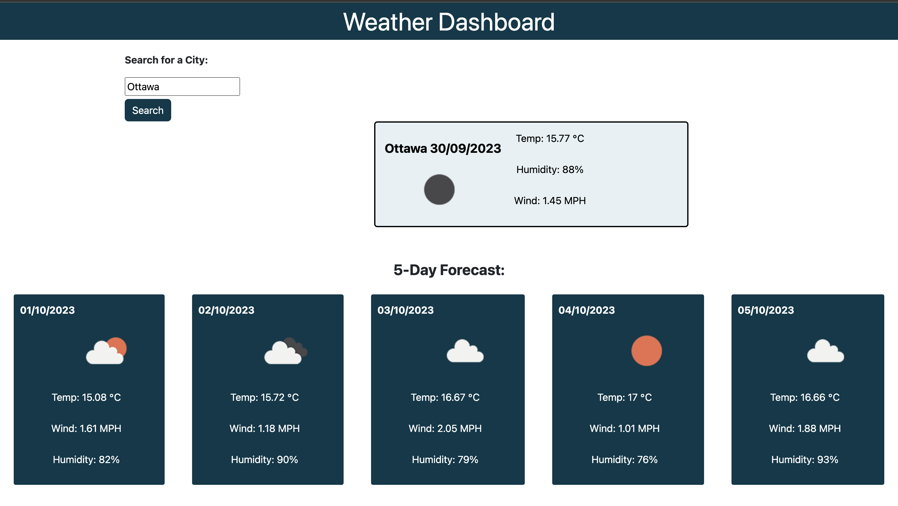

# Weather Dashboard

## Description

This is front-end application is weather dashboard that runs in the browser and features dynamically updated HTML and CSS. It shows the present and future weather conditions for a search city.

## Table of Contents

- [Installation](#installation)

- [Usage](#usage)

- [License](#license)

- [Credit](#credit)  

- [APIs](#apis)

- [Deployment](#deployment)

- [References](#references)

## Installation

N/A

## Usage

Open the application in the browser, enter the name of the city you want to search and click the search button. The weather info is dynamically generated and can be seen on the screen. To search another city, refresh the browser and repeat the steps.

The following image shows the application's functionality:  

## License

N/A

## Credit

AskBCS tutors

Dane Shrewsbury

Added comments with the help of ChatGPT

## APIs

[5 Day Weather Forecast](https://openweathermap.org/forecast5)

## Deployment

Here is the link to the web application:

[Weather Dashboard](https://wdverse.github.io/Weather-Dashboard/)

## References

Course material

W3 Schools

[Coolors](https://coolors.co/)
